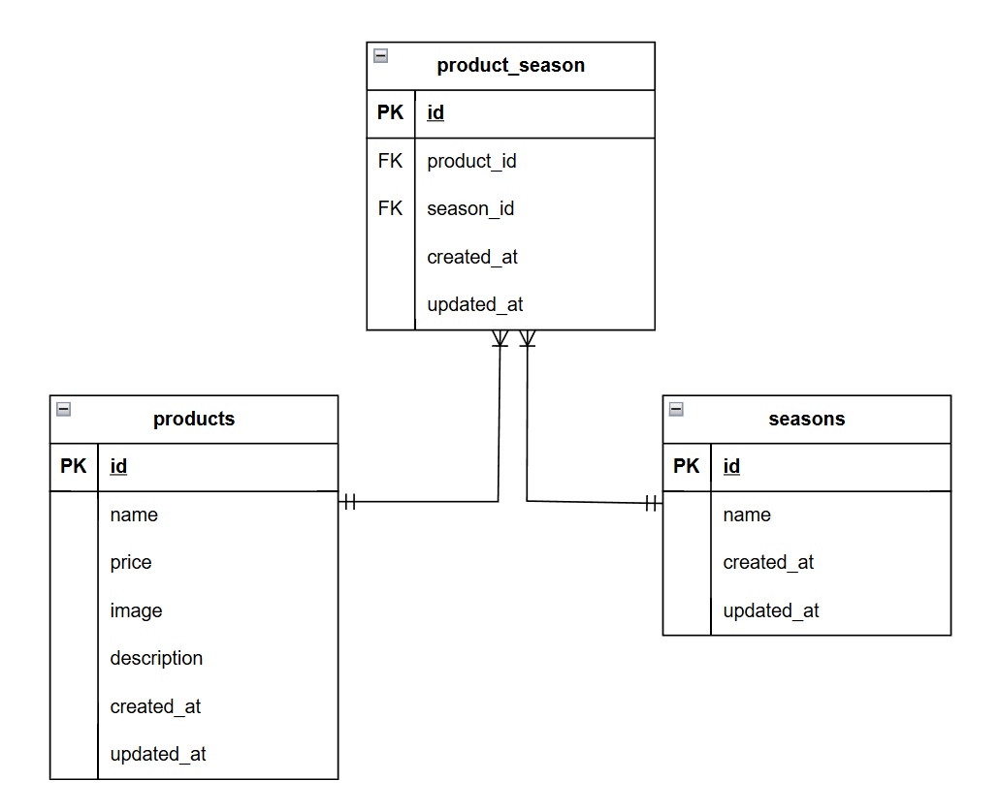

# Mogitate(もぎたて)

## 環境構築
**Dockerビルド**
1. `git clone git@github.com:kozu-ike/freshly-picked.git`
2. DockerDesktopアプリを立ち上げる
3. `docker-compose up -d --build`

**Laravel環境構築**
1. `docker-compose exec php bash`
2. `composer install`
3. 「.env.example」ファイルを 「.env」ファイルに命名を変更。または、新しく.envファイルを作成
`cp .env.example .env`
4. .envに以下の環境変数を追加
``` text
DB_CONNECTION=mysql
DB_HOST=mysql
DB_PORT=3306
DB_DATABASE=laravel_db
DB_USERNAME=laravel_user
DB_PASSWORD=laravel_pass
```
5. アプリケーションキーの作成
``` bash
php artisan key:generate
```

6. マイグレーションの実行
``` bash
php artisan migrate
```

7. シーディングの実行
``` bash
php artisan db:seed
```

## 画像ファイルの取り扱い
プロジェクトに画像ファイルが必要な場合は、リポジトリに含まれる `fruits-img.zip` を解凍し、`storage/app/public/products` フォルダに配置してください。

1. `fruits-img.zip` を解凍
2. 解凍した画像を `storage/app/public/products` フォルダに配置

## シンボリックリンクの作成
画像やファイルを正しく保存・表示するために、以下のコマンドを実行してシンボリックリンクを作成してください：

```bash
php artisan storage:link
```

## 使用技術(実行環境)
- PHP 8.2.27
- Laravel 8.83.29
- MariaDB 10.11.6

## ER図


## URL
- 開発環境：http://localhost/
- phpMyAdmin:http://localhost:8080/

